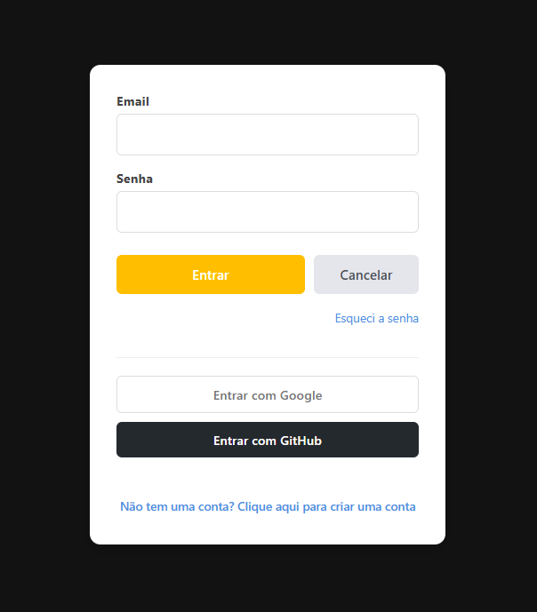
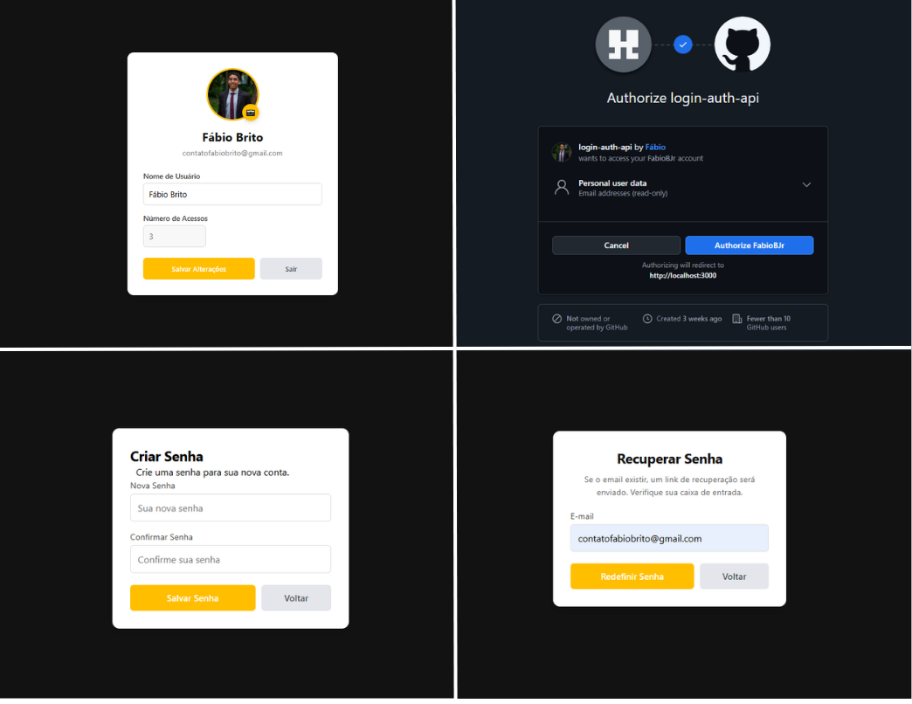

# Web Login

<p align="right">
  <strong>English</strong> |
  <a href="README.pt-BR.md">Português (Brasil)</a>
</p>



I wanted to explore the fundamentals and understand how these things work, so I limited myself to use only<br>
the node tools and avoid using frameworks and libraries like Express and JWT.

- Used a LLM model as a resource to help at the development and at the front-end design.

## About
The application runs the main login authentication routines, <br>
executes the main validations in this process and integrate with other <br>
platforms by the oAuth2 protocol.

### Functionalities
- **Password recover** with e-mail trigger
- Authorization token expiration
- **Sign In/Sign Up** with Github
- **Sign In/Sign Up** with Google
- **Data Synchronization** with other platforms
- Profile edition

## How to Run
### Pre-installation
Make sure that Node.js `v20.6.0+` and PostgreSQL `v14+` are installed.

### Setting `.env`
Create an `.env` file at the root of the project with the following variables:
```env
#Auth
JWT_SECRET=chave_para_gerar_token_jwt

#Database
DB_USER=seu_usuario
DB_HOST=localhost
DB_NAME=nome_do_banco
DB_PASSWORD=senha_pgadmin
DB_PORT=porta_do_banco

#Mail
MAIL_HOST=
MAIL_PORT=
MAIL_USER=
MAIL_PASS=

#Github
GITHUB_CLIENT_ID=
GITHUB_CLIENT_SECRET=

#Google
GOOGLE_CLIENT_ID=
GOOGLE_CLIENT_SECRET=
```

### Installation

1. Clone the repository in your computer:
    ```bash
    git clone https://github.com/FabioBJr/login-authentication-api.git
    ```
2. Inside the project install the project's packages:
    ```bash
    npm install
    ```
3. Create the user table:
    ```bash
    node src/setup.js
    ```
4. Initialize the application:
    ```bash
    node src/server.js
    ```

### Run
Access it locally in your browser at `http://localhost:3000`.

## Application


